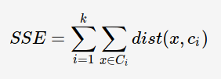

[【十大经典数据挖掘算法】][https://www.cnblogs.com/en-heng/p/5173704.html]
=============
[https://www.cnblogs.com/en-heng/p/5173704.html]: 【十大经典数据挖掘算法】

1. ## **k-means**  
    - k-means 是聚类算法中最简单, 最高效的.
    - 核心思想: 由用户指定K个初始质心,依此作为聚类的类别,重复迭代直至算法收敛  
    
    - k-means的计算方法如下:  
      1. 随机选取K个中心点    
      2. 遍历所有数据,计算每个点到所有k个中心点的距离,将每个数据划分到距离最近的中心点中  
      3. 计算每个聚类的平均值,并作为新的中心点  
      4. 重复2和3步骤,直到这k个中心点不再变化(收敛)或者执行了足够多的迭代次数  
    - 收敛: 对于欧式空间的样本数据,以平方误差和(SSE)作为聚类的目标函数,同时也可以衡量不同聚类结果的好坏:  
        
     `表示样本点X到质心距离平方和; `   
     最优的聚类想过应使得SSE达到最小值
     
    - 缺点:   
        + k-means是局部最优的,容易受到出世质心的影响 
        + K值的选取也会直接影响聚类结果,最优聚类的K值应与样本数据本身的机构信息想吻合,而这种结构信息是很难去掌握,因此选取最优K值是非常困难的
        